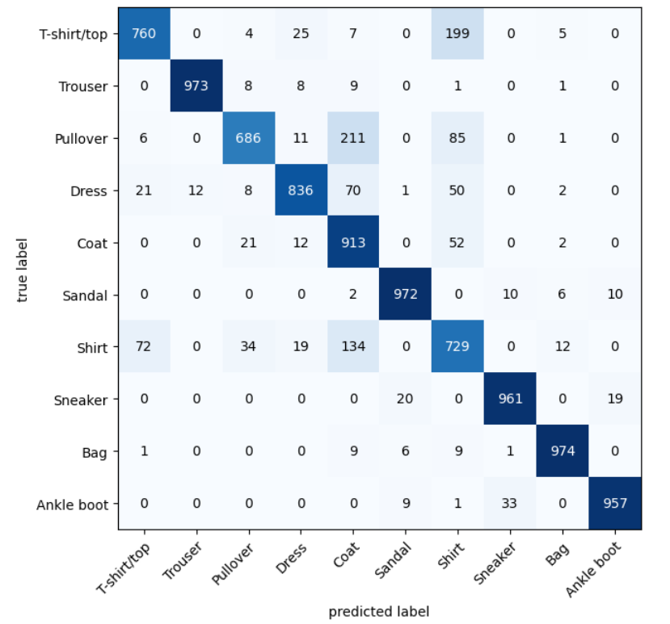

# cloath-recognition-model
model that classify what cloth image is this

**🔍 Project Overview**
This project uses image recognition to identify types of cloth from images. It leverages Convolutional Neural Networks (CNNs) trained on a dataset of labeled food images.

**🛠️ Technologies Used**
- Python
- TensorFlow
- Jupyter Notebook
- google collab

**📚 Library used**
- torch
- torchvision
- matplotlib

**🚀 Workflow**
get cloth image dataset from kaggel (fashionmnist dataset)
Preprocessed images (resize, normalize)
Trained a CNN model.
Evaluated accuracy and loss

**📊 Results**
Accuracy: 83% on validation set

## 📸 Screenshot

